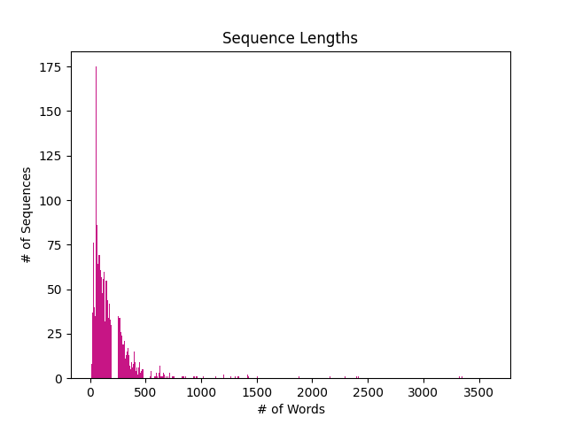

# medGPT
The architecture of this model [1,2] is similar to that defined in the *Attention Is All You Need* paper [3]. It features no cross-attention, GeLU instead of ReLU in the feed-forward network, and places the normalization layers before the attention mechanism rather than after. Additionally, an extra normalization layer is added after the final attention mechanism. Many of the parameters align with those in the original paper; however, the learning rate for each parameter group utilizes a cosine annealing schedule. The model has the following parameters:

| Block Size | Vocab Size | Num of Embeddings |  Num of Heads |  Num of Layers |
| :---:   | :---: | :---: | :---: | :---: |
| 1024 | 50257 | 600 | 12 | 12 |

The model is trained using the MedQuAD dataset [4, 5], which consists of medical questions and answers. The dataset has a total of 16,413 rows, many of which have multiple answers for the same question. After manual inspection, only the first answer corresponding to each question was retained, effectively decreasing the dataset size by roughly half. After combining the questions and answers into sequences, many had a length of 500 words, though some were as long as 3,500 words. Given CPU capabilities, only sequences with 500 words or fewer were considered for training.

When applicable, the model utilizes Distributed Data Parallel to speed up processing [6]. During training, the model generates hypotheses for the context *"How many people are affected by Balance Problems?"* and produces four answer candidates. These generated answers are compared to the actual answers from the MedQuAD dataset using the SacreBLEU metric [7]. SacreBLEU is a score that reflects how similar the generated output is to the expected output. 

### Example output generated by the model:

Question: *How many people are affected by Balance Problems?*

Expected Output: *In 2008, an estimated 14.8 percent of American adults (33.4 million) had a balance or dizziness problem during the past year. See statistics about the frequency of balance and other sensory impairments in older adults. (Centers for Disease Control and Prevention)*

Model Response: *This is the In and a to or treatment of a medical in the the these to a these other. in the prevent be the this brain, the may who This treat cause a the result may brain and*

### Perfomance 

Performance when training on ~3.2M tokens and 75 warmup steps + 330 steps (1 epoch):

| Step | Step 200  | Step 300 |  Step 329 (Last Step) |
| :---: | :---: | :---: | :---: |
| Val Loss | 6.8737 | 6.7257 | 7.0891 |
| Loss | 6.6336 | 6.7238 | 6.2634 |
| BLEU | 1.4050 | 1.2521 | 1.1658 |

### Next Steps

The unpredictable patterns of BLEU scores and increased validation loss indicate that the model is overfitting. Implementing early stopping, using a larger dataset, and decreasing the model complexity may help address overfitting. Potential next steps include training on more data, extending training beyond one epoch, and incorporating more embeddings. Additionally, incorporating label smoothing could help improve the BLEU score.

References:

[1] Karpathy, A. (2024). NanoGPT Training Script. [GitHub repository](https://github.com/karpathy/build-nanogpt/blob/master/train_gpt2.py).

[2] Smith, R. (2023). Medical NLP Overview. [NCBI article](https://www.ncbi.nlm.nih.gov/pmc/articles/PMC10654385/).

[3] Vaswani, A., Shazeer, N., Parmar, N., Uszkoreit, J., Jones, L., Gomez, A. N., Kaiser, Ł., Polosukhin, I. (2017). Attention Is All You Need. [arXiv preprint arXiv:1706.03762](https://arxiv.org/pdf/1706.03762).

[4] Ben Abacha, A., & Demner-Fushman, D. (2019). A Question-Entailment Approach to Question Answering. [BMC Bioinformatics, 20(1), 511:1–511:23].(https://bmcbioinformatics.biomedcentral.com/articles/10.1186/s12859-019-3119-4).

[5] Miller, J. P. (2023). LayoutLM Dataset. [Kaggle dataset](https://www.kaggle.com/datasets/jpmiller/layoutlm/data).

[6] Bhansali, N. (2023). Data Parallelism with PyTorch on CPUs. [Medium article](https://medium.com/@nishantbhansali80/data-parallel-with-pytorch-on-cpus-3e89312db6c0).

[7] Nlplanet. (2023). Understanding BLEU Metric by Examples. [Medium article](https://medium.com/nlplanet/two-minutes-nlp-learn-the-bleu-metric-by-examples-df015ca73a86).

